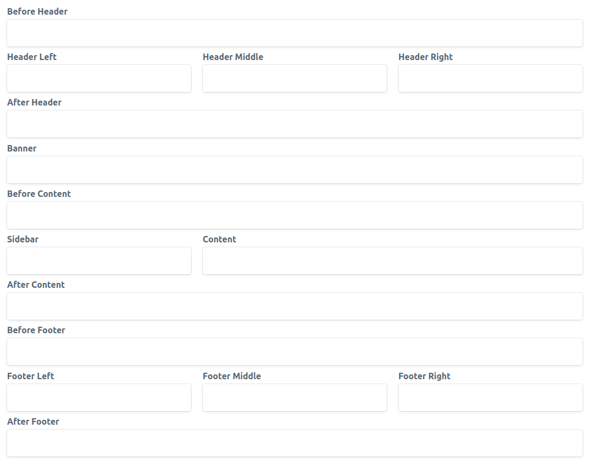
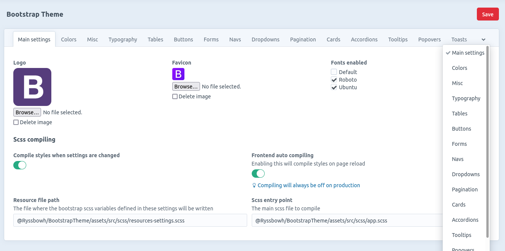

# Bootstrap Theme for Craft 3.5

This is an example theme for [Craft Themes](https://plugins.craftcms.com/themes) based on Boostrap 5 (5.1.3), while it works as is, it's mostly intended to be inherited from by your custom theme(s) as its css/js developments are minimal.

This theme requires Craft Themes in Pro edition to use all its features but can be used in lite version too.

## Regions



## Settings

### Scss

Almost every bootstrap scss variable has been mapped into its own setting editable in the CP. All settings will take bootstrap's default if left unchanged.  
Saving these settings will generate a scss file which combined with bootstrap scss during compilation will change how things look like.



After changing this settings the scss must be recompiled for changes to take effect, there are several ways to do this :
- Disable this plugin scss auto compilation and compile the scss using an external tool of your choice (webpack, gulp etc), you only need to include that generated file before bootstrap library to include the changes. The file is `assets/src/scss/resources-settings.scss` (that can be changed in the settings)
- Keep auto compilation either when you change settings or when the frontend is reloaded
- If you have a theme that extends from this plugin, simply import the generated file in your custom scss, the file will be found using scss file import inheritance.

You can add extra scss variables you may need to those settings through events :

```
use Ryssbowh\BootstrapTheme\models\Settings;

class MySettingsTab extends BootstrapSettings
{
    /**
     * @inheritDoc
     */
    public function getName(): string
    {
        return 'My tab';
    }

    /**
     * @inheritDoc
     */
    public function getHandle(): string
    {
        return 'my-tab'
    }

    /**
     * @inheritDoc
     */
    public function init()
    {
        //Valid values for 'type': text, date, time, color, dateTime, textarea, select, selectrgba, multiselect, checkbox, lightswitch, radioGroup, checkboxSelect, checkboxGroup, autosuggest
        $this->definitions = [
            'my-variable' => [
                'type' => 'text',
                'options' => [
                    'label' => $this->t('My variable'),
                    'instructions' => $this->t('Defaults to {default}', ['default' => $this->t('default')])
                ]
            ],
            //Select dropdown using all defined colors :
            'my-color' => [
                'type' => 'select',
                'value' => '$blue',
                'options' => [
                    'label' => $this->t('My color'),
                    'instructions' => $this->t('Defaults to {default}', ['default' => 'Blue']),
                    'values' => '#colors'
                ]
            ],
            //Rgba colors also shows an opacity input :
            'rgba-color' => [
                'type' => 'selectrgba',
                'options' => [
                    'label' => $this->t('Rgba color'),
                    'instructions' => $this->t('Defaults to {default}', ['default' => 'rgba($black, .125)']),
                    'options' => '#colors'
                ]
            ],
            //Select dropdown using all defined fonts
            'my-font' => [
                'type' => 'select',
                'options' => [
                    'label' => $this->t('My font'),
                    'options' => '#fonts',
                    'tip' => $this->t('Make sure it\'s enabled in the main settings'),
                ]
            ],
            //Custom function to generate the value
            'rgba-color' => [
                'type' => 'text',
                'options' => [
                    'label' => $this->t('Custom variable'),
                    'instructions' => $this->t('Defaults to {default}', ['default' => 'my-mixin($variable, 10%)'])
                ],
                'valueCallback' => function ($value, $settings) {
                    return 'my-mixin(' . $value . ', 10%)';
                }
            ],
        ];
    }
}

Event::on(Settings::class, Settings::EVENT_SETTINGS, function (SettingsEvent $e) {
    $e->add(new MySettingsTab);
});
```
Or modify existing ones :

```
Event::on(Settings::class, Settings::EVENT_SETTINGS, function (SettingsEvent $e) {
    $colors = $e->get('colors');
    $colors->definitions[] = [
        'my-color' => [
            'value' => '#ffffff',
            'type' => 'color',
            'baseColor' => true, //Base colors will show into every color dropdowns
            'options' => [
                'label' => $this->t('My color')
            ]
        ]
    ];
});
```

### Fonts

You can add downloable fonts with the same event, those fonts will become available to choose from in the settings, and will be automatically added on the frontend if selected :
```
Event::on(Settings::class, Settings::EVENT_SETTINGS, function (SettingsEvent $e) {
    $e->fonts[] = [
        'ubuntu' => [
            'fonts' => [
                'Roboto',
            ],
            'url' => 'https://fonts.googleapis.com/css2?family=Roboto:ital,wght@0,100;0,300;0,400;0,500;0,700;0,900;1,100;1,300;1,400;1,500;1,700;1,900&display=swap'
        ],
    ];
});
```

## Displayers

**New displayers :**  
- [Carousel](https://getbootstrap.com/docs/5.0/components/carousel/), for Assets fields.  
- [Accordion](https://getbootstrap.com/docs/5.0/components/accordion/) for Assets, Categories, Entries, Matrix and Users fields.  
- [Card](https://getbootstrap.com/docs/5.0/components/card/) for Assets, Categories, Entries, Matrix and Users fields.  
- [List Group](https://getbootstrap.com/docs/5.0/components/list-group/) for Assets, Categories, Entries, Matrix, Tags and Users fields.  

The field displayers ElementLink, UrlLink, ElementLinks, Email and the file displayer Link now have [buttons](https://getbootstrap.com/docs/5.0/components/buttons/) options :  
- Display as button
- Color
- Size
- Outlined

The TagLabel displayer now have [badge](https://getbootstrap.com/docs/5.0/components/badge/) options :  
- Display as badge
- Background color
- Pill (rounded)

## Bootstrap components

Several templates are available to include or extend from in the [components folder](src/templates/front/components)
- [alert](https://getbootstrap.com/docs/5.0/components/alerts/)
- [badge](https://getbootstrap.com/docs/5.0/components/badge/)
- [breadcrumbs](https://getbootstrap.com/docs/5.0/components/breadcrumb/)
- [button](https://getbootstrap.com/docs/5.0/components/buttons/)
- [dropdowns](https://getbootstrap.com/docs/5.0/components/dropdowns/)
- [list groups](https://getbootstrap.com/docs/5.0/components/list-group/)
- [modal](https://getbootstrap.com/docs/5.0/components/modal/)
- [nav](https://getbootstrap.com/docs/5.0/components/navs-tabs/)
- [offcanvas](https://getbootstrap.com/docs/5.0/components/offcanvas/)
- [pagination](https://getbootstrap.com/docs/5.0/components/pagination/)
- [progressbar](https://getbootstrap.com/docs/5.0/components/progress/)
- [spinner](https://getbootstrap.com/docs/5.0/components/spinners/)
- [toast](https://getbootstrap.com/docs/5.0/components/toasts/)

[Tooltips](https://getbootstrap.com/docs/5.0/components/tooltips/) and [Popovers](https://getbootstrap.com/docs/5.0/components/popovers/) can be achieved with the [button component](src/templates/front/components/button.twig). They will be automatically initiated on page load.

View [components documentation](COMPONENTS.md) :

## Assets

The `BootstrapJsAssets` bundle will include bootstrap javascript
The `FrontCssAssets` bundle will include the scss compiled css, will compile them on the spot if enabled in the settings  
The `FrontJsAssets` will include a small amount of javascript to activate Popovers and Tooltips
The `WebpackFrontAssets` will include assets generated by webpack, this is more an example than anything else